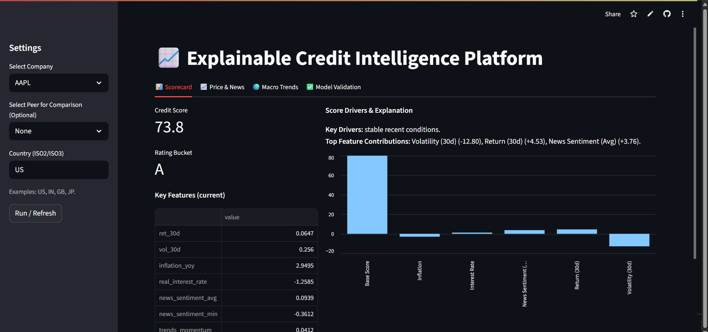

# Explainable Credit Intelligence Platform

**CredTech Hackathon Submission | Organized by The Programming Club, IITK**

This platform provides real-time, explainable credit scores for public companies. It moves beyond traditional, slow-moving credit ratings by ingesting high-frequency, alternative datasets to generate a dynamic and transparent assessment of creditworthiness.

The core challenge of this project was to replace the "black box" of credit scoring with a system that is transparent, evidence-backed, and immediately useful to a financial analyst.

---

### 🚀 Live Demo

**You can access the live, deployed application here:**

(https://explainable-credit-intelligence-ijpjs7bo6dgjftua6p8dgc.streamlit.app/)

### 📸 Screenshot

 
*(**Note:** Please replace this link with a screenshot of your running application)*

---

## ✨ Core Features

This platform is built on four key pillars:

**1. Real-Time, Multi-Source Data Ingestion:**
   - **Structured Data:** Ingests daily stock price data from **Yahoo Finance** and macroeconomic indicators (Inflation, Real Interest Rates) from the **World Bank API**.
   - **Unstructured Data:** Fetches and analyzes real-time **Google News** headlines for sentiment analysis.
   - **Alternative Data:** Integrates **Google Trends** data to measure public interest and brand momentum, acting as a leading indicator of performance or risk.

**2. Explainable Heuristic Scoring Engine:**
   - Generates a 0-100 credit score and a corresponding letter rating (e.g., AAA, BBB, B).
   - The score is calculated using a transparent, "white-box" heuristic formula, where every component's contribution is visible.
   - The bar chart visualization provides a clear breakdown of the factors driving the score.

**3. Standout Analytical Features:**
   - **Peer Comparison:** Allows an analyst to directly compare a company's key metrics against a competitor, turning raw data into actionable insights.
   - **Event Risk Detection:** The model specifically scans for catastrophic single news events (e.g., headlines with sentiment below -0.75) and applies a direct penalty, mimicking real-world risk analysis.
   - **Plain-Language Summaries:** Automatically generates human-readable explanations of the key drivers behind each score.

**4. Built-in Model Validation Framework:**
   - Includes a dedicated "Model Validation" tab to build trust and prove the model's logic.
   - **Benchmark Comparison:** Directly compares our model's ratings for key companies (MSFT, TSLA) against real-world S&P ratings.
   - **Sensitivity Analysis:** Features an interactive chart showing how the credit score correctly responds to changes in key risk factors like volatility.

---

## 🛠️ Tech Stack & Architecture

### Tech Stack
- **Language:** Python
- **Web Framework:** Streamlit
- **Data Manipulation:** Pandas, NumPy
- **Data Sources:** yfinance, pytrends, feedparser, requests
- **NLP:** NLTK (VADER for Sentiment Analysis)

### System Architecture
The application follows a simple, robust, and scalable architecture suitable for rapid development and deployment.

1.  **Presentation Layer (Frontend):**
    - Built entirely with **Streamlit**. This layer handles all user interactions (widgets, tabs, charts) and presents the final data.

2.  **Business Logic Layer (Backend):**
    - Contained within the `app.py` script. This layer is responsible for:
        - Taking user input from the frontend.
        - Orchestrating calls to the data ingestion layer.
        - Assembling the final feature set.
        - Executing the `calculate_heuristic_score` function to generate the score and explanations.

3.  **Data Ingestion Layer:**
    - A series of helper functions (`get_prices`, `worldbank_indicator`, `fetch_news_rss`, `get_trends_feature`) that are responsible for connecting to external APIs and returning clean DataFrames.

4.  **Data Caching Layer:**
    - This layer has two components for performance and fault tolerance:
        - **Streamlit Caching (`@st.cache_data`):** Caches the results of expensive API calls in memory to make the app fast and responsive.
        - **Filesystem Caching (`cached_data/`):** A folder containing pre-downloaded stock data. The app is programmed to fall back to these local files if the live Yahoo Finance API fails, ensuring the application is always functional.

---

## ⚙️ Installation & Running Locally

To run this application on your local machine, please follow these steps:

**Prerequisites:**
- Python 3.9+
- `git`

**Instructions:**

1.  **Clone the repository:**
    ```bash
    git clone [YOUR GITHUB REPO LINK]
    cd explainable-credit-platform 
    ```

2.  **Create and activate a virtual environment:**
    ```bash
    # For Windows
    python -m venv venv
    .\venv\Scripts\activate

    # For macOS/Linux
    python3 -m venv venv
    source venv/bin/activate
    ```

3.  **Install the required libraries:**
    *(Make sure you have created the `requirements.txt` file by running `pip freeze > requirements.txt`)*
    ```bash
    pip install -r requirements.txt
    ```

4.  **Download NLTK data (first time only):**
    The app will automatically prompt you to download the 'vader_lexicon' if it's not found.

5.  **Run the Streamlit application:**
    ```bash
    streamlit run app.py
    ```
    The application should now be open and running in your web browser.

---

## ⚖️ Model Design & Trade-offs

A core decision in this project was the choice of scoring model.

**Heuristic Model vs. Machine Learning Model**

We intentionally chose a **transparent heuristic model** over a more complex machine learning model (like a Gradient Boosting Tree or Neural Network).

**Reasoning:**

1.  **Perfect Explainability:** The central challenge of the hackathon was to avoid a "black box." Our heuristic model is a "white box"—every calculation is simple, direct, and fully traceable. This allows us to generate perfect feature contributions without needing secondary explanation layers like SHAP.

2.  **Addressing the "Cold Start" Problem:** A supervised machine learning model would require a large, labeled dataset of companies with "correct" credit scores. Such a dataset is not readily available. Our heuristic approach, based on established financial principles, works immediately without needing to be trained.

3.  **Validation over Traditional Accuracy:** Since we can't measure accuracy against a "ground truth" dataset, we instead built a robust **validation framework** within the app itself. The "Model Validation" tab proves that our model is directionally correct (Benchmark Comparison) and logically sound (Sensitivity Analysis), which is the most appropriate way to build trust in this context.
